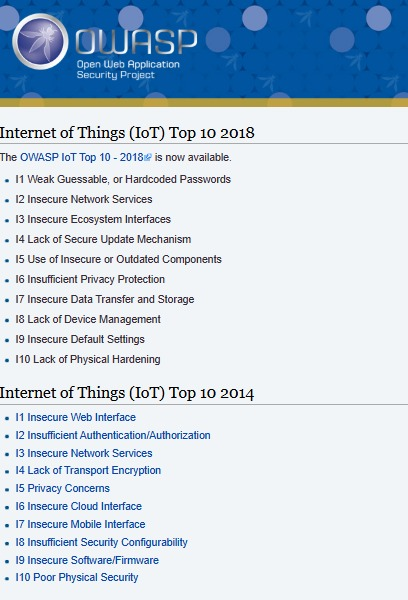
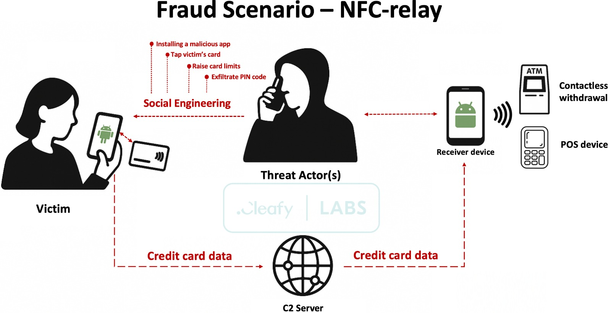

# NFC vs Bluetooth Risk Assessment

## Overview
This project compares the security risks of NFC (Near Field Communication) and Bluetooth technologies using OWASP IoT risk standards.

## Technologies Compared
- Executive summary
- Technical Architecture & Security Foundations
- Vulnerability Deeep-Dive
- Comprehensive Threat Catalogue
- Comparative //risk Matrix
- OWASP IoT Top 10Framework Mapping
-Mitigation Strageies & System Hardnerning
- Final Risk Ranking & Conculsuion 
## Conclusion
NFC is generally more secure due to its short communication range, while Bluetooth has higher exposure to attacks due to its wider range.
## Screenshots

### NFC Example

### Bluetooth Example

## Project Repository

You can find the complete project on GitHub:

[View on GitHub](https://github.com/owoadeolaoluwa-cyber/NFC-Bluetooth-Risk-Assessment-2026/)
